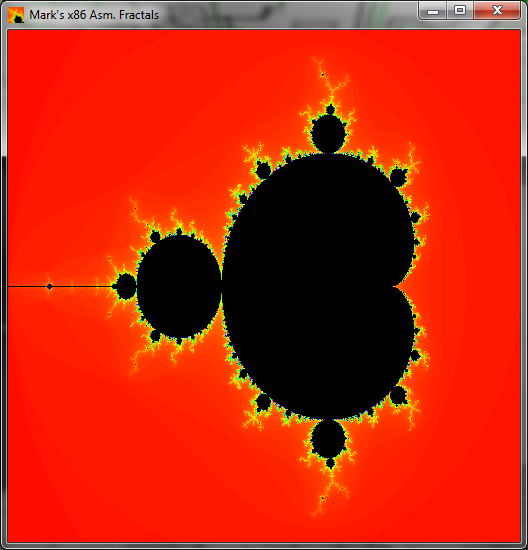
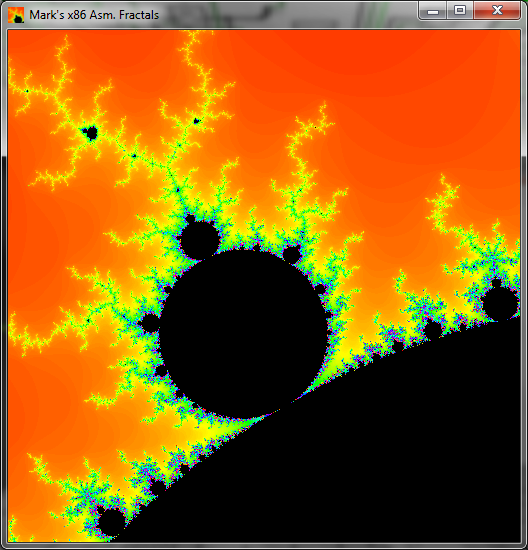
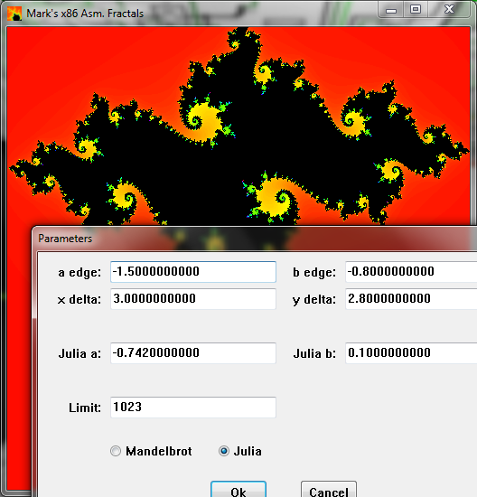
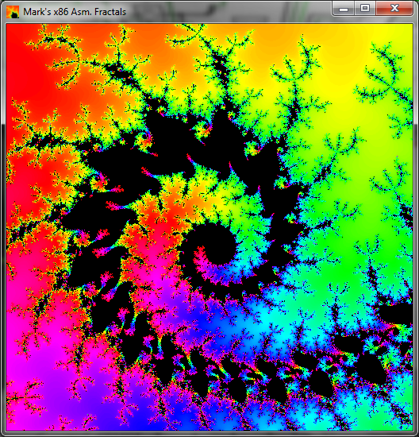

x86 Inline Assembly Mandelbrot and Julia Fractal Program (Windows)
==================================================================

<table>
<tr><td></td><td></td></tr>
<tr><td></td><td></td></tr>
</table>
 
## Introduction

This is a Mandelbrot and Julia Set fractal program written in x86 (inline)
assembly language.  I chose inline because I didn't want to code the Windows
GUI stuff in assembly.  This program is based on the fractal program I wrote
for a CPU / computer design I created.  I have included that original program
in case you want to see how this project has evolved.  I created the x86 version
in order to learn x86 assembly language and in order to create a tutorial video
on x86 assembly language.  Because of this, I purposely only used basic x86
assembly.  That means no SSE, SSE2, AVX-512, etc.  Using newer x86 instructions
(vector, etc.) would make it faster, but would make it a bit harder to
understand and would deviate quite a bit from my original program (for my CPU
design).  For example, fmul versus VPCLMULQDQ to multiply.  Besides, GPU would
be faster anyway, in which case you wouldn't even use assembly.

This is not meant to be the best, most versatile, fractal program.  It was
meant to show assembly language programming.  BTW, this is why it's 512x512
resolution (with a 256x256 mode) - the original program was 256x256 due to the
resolution of Logisim's video screen component.  (Logisim is the simulation
program I used to simulate my CPU design - refer to my various videos to see
what I mean).

## Running

Start from either command line or icon.
**Once started, press 'h' to see the various keyboard controls.**  Or press
'0' through '9', '-', or 'a' to go to preset areas of the fractals.  To zoom,
press either 'z' for zoom by opposing corners or 'x' for zoom by center to
corner.  Then click (and hold) left mouse button to select first point and
drag to second point (and release).  Press 'u' to undo the zoom.  Zoom by
default preserves the square aspect ratio.  If that is not desired, press 'k'
to toggle that feature off/on.  Press 'p' to set or view the fractal
parameters.  BTW, to get images like the ones in my videos, lower the
(iteration) limit to 255 (via parameters dialog box).

Also, right click on the title bar of the main window to get a menu option to
save the current image to a PPM file.

Most of the keyboard controls can be put on the command-line as if you pressed
them while the program is running.  For example:

    fractald 3-cd...

would choose Mandelbrot location #3 (3) to be displayed, then Mandelbrot
location #4 (-), then color cycling enabled (c), then cycling direction
changed (d), then cycling delta increased three times (.)

## Building

Windows executables are provided, so there shouldn't be a need to build, but if
you need to...

Assuming you're using Microsoft Visual Studio and assuming you have the DOS
compiling environment set up (adjust accordingly for other IDEs):

    nmake /f fractal.mak

This will make both the double and float versions of the fractal program.

If you don't want to use makefiles, it should be easy to make a solution file
for this project (or whatever it will be called in future versions of
Visual Studio).

## Link to Linux Version

[https://github.com/mrmcsoftware/FractalAsm-Linux](https://github.com/mrmcsoftware/FractalAsm-Linux)

## Manifest

<table>
<tr><td>fractald.c</td><td>"double" version of x86 fractal program - higher precision, but most likely slower</td></tr>
<tr><td>fractalf.c</td><td>"float" version of x86 fractal program</td></tr>
<tr><td>dialog.h</td><td>Dialog and Menu GUI ids</td></tr>
<tr><td>fractal.rc</td><td>Resource script file defining parameter dialog box, icon, etc.</td></tr>
<tr><td>fractal.exe.manifest</td><td>Manifest file to tell Windows to use newer common controls</td></tr>
<tr><td>fractal.ico</td><td>Icon file</td></tr>
<tr><td>fractal.mak</td><td>Makefile</td></tr>
<tr><td>&nbsp;</td><td>&nbsp;</td></tr>
<tr><td>fractalb_not_x86.asm</td><td>My original fractal program for my CPU design</td></tr>
<tr><td>&nbsp;</td><td>&nbsp;</td></tr>
<tr><td>fractald.exe</td><td>32-bit Windows executable (double version)</td></tr>
<tr><td>fractalf.exe</td><td>32-bit Windows executable (float version)</td></tr>
<tr><td>&nbsp;</td><td>&nbsp;</td></tr>
<tr><td>fractal*.png</td><td>Screenshots</td></tr>
<tr><td>README.md</td><td>This file</td></tr>
</table>

## Demonstration Videos

[My x86 assembly language tutorial video containing an earlier version of this fractal program (starting at 3:42)](https://www.youtube.com/watch?v=KgPVx_kfBik)

[Part 1 of that x86 assembly language tutorial](https://www.youtube.com/watch?v=2i935mP6hUM)

[My CPU / computer design running my original fractal program written for that design](https://www.youtube.com/watch?v=ygf0aa1r3NY)

## Author

Mark Craig
[https://www.youtube.com/MrMcSoftware](https://www.youtube.com/MrMcSoftware)
